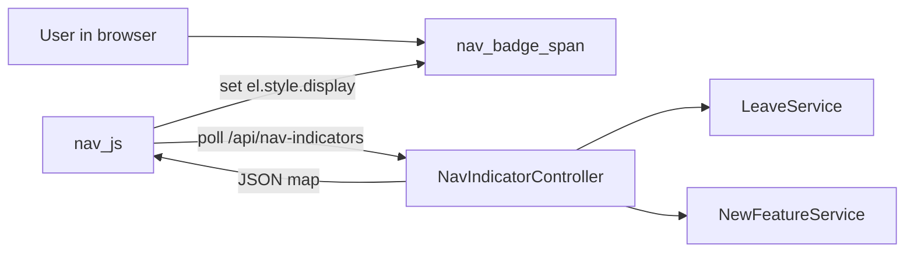

# Nav Indicator Extension Guide

This plan explains how to add new nav badge indicators (like the existing leave indicator) using the shared backend API and frontend conventions already in place.

## 1. Architectural overview

- **Backend controller**: `NavIndicatorController` exposes `GET /api/nav-indicators`, returning a JSON map like `{ "leave": true, "deductions": false }`.
- **Per-feature services**: Each feature (leave, deductions, etc.) decides whether its indicator should be on/off.
- **Templates**: Nav items include a badge `<span>` with a `data-nav-indicator="key"` attribute; Thymeleaf sets initial visibility.
- **Frontend JS**: `nav.js` periodically calls `/api/nav-indicators` when the tab is visible and toggles `display` on all `[data-nav-indicator]` elements.

A high-level data flow:




## 2. Decide the indicator semantics

Before writing code, answer for the new indicator:

- **What does the badge mean?** (e.g. unread deductions, overdue approvals, draft changes, etc.)
- **Who sees it?** (admins only, employees only, or both?)
- **How do we compute it?**
  - Usually a boolean like "hasAnyUnread" or "hasPendingItems".
  - Prefer a single fast query (e.g. `COUNT(*) WHERE status='PENDING' AND ...`).

Document this in a short comment when you add the key in `NavIndicatorController`.

## 3. Backend: add a new key to `/api/nav-indicators`

1. **Open** `src/main/java/digital8/payroll/controllers/NavIndicatorController.java`.
2. **Locate** `getNavIndicators(Authentication authentication)`.
3. **Add a new boolean flag** for your feature, following the pattern used for `leave`:
  - If the feature already has a service, inject it.
  - Compute the boolean based on the authenticated user.
  - Put it into the `out` map using a stable key string.

Example pattern to follow (pseudo-code, not exact):

```java
boolean deductions = false;
if (authentication.getAuthorities().contains(new SimpleGrantedAuthority("ROLE_ADMIN"))) {
    deductions = deductionService.hasPendingForAdmin();
} else if (user.getEmployee() != null) {
    deductions = deductionService.hasUnreadForEmployee(user.getEmployee().getEmployeeId());
}
out.put("deductions", deductions);
```

### 3.1. Add or reuse a feature service

If a service method does not exist:

- Add it to the appropriate service class (e.g. `DeductionsService`).
- Keep it **fast** and **boolean**: return `true`/`false`, not a whole list.
- Implement it using a focused repository query (e.g. a `COUNT` method on the repository).

## 4. Backend (optional): initial Thymeleaf model values

The nav indicator system already works without extra model attributes, because initial visibility is controlled via `th:style` expressions derived from existing counts. When adding a new indicator:

- If you already have a count or boolean in a `@ControllerAdvice` (like `NavIndicatorAdvice` for leave), reuse it.
- Otherwise, consider adding a **new `@ModelAttribute`** there, returning a primitive (long or boolean) that templates can reference for initial style.

This keeps server-rendered HTML correct on first load, before JS runs.

## 5. Templates: add or extend badge spans

For every nav location where you want the new indicator:

1. **Find the template** under `src/main/resources/templates/html/` (e.g. `homeAdmin.html`, `deductions.html`, `settingsAdmin.html`).
2. **Locate the corresponding nav link** (anchor + `li`) for the feature.
3. **Add or modify a badge span** immediately after the label span:
  - Include `class="nav-indicator"`.
  - Add `data-nav-indicator="<key>"` using the same key string you put in the API map.
  - Use `th:style` to control initial visibility (empty string vs `display:none`).

Example (new deductions indicator for admins):

```html
<a href="/admin/deductions" title="Deductions">
  <li>
    <i class="fa-solid fa-minus-circle"></i>
    <span class="nav-label">Deductions</span>
    <span
      class="nav-indicator"
      data-nav-indicator="deductions"
      th:style="${hasPendingDeductions} ? '' : 'display:none'"
      title="Pending deductions"
      aria-label="Pending deductions">
      <i class="fa-solid fa-circle-exclamation"></i>
    </span>
  </li>
</a>
```

If you do **not** yet have a boolean like `${hasPendingDeductions}`:

- Temporarily set `th:style="'display:none'"` so the badge starts hidden, and rely solely on JS updates; or
- Add a model attribute using `NavIndicatorAdvice` or the relevant controller.

## 6. Frontend JS: how nav.js consumes indicators

The existing `nav.js` logic already supports multiple indicators:

- It selects **all** elements with `[data-nav-indicator]`.
- It calls `/api/nav-indicators` when the tab is visible.
- For each element:
  - Reads the `data-nav-indicator` value (e.g. `"leave"`, `"deductions"`).
  - Looks up `data[key]` in the JSON map.
  - Sets `el.style.display` to `''` or `'none'`.

Because of this, **you usually do not need to change `nav.js`** when adding a new indicator, as long as you:

- Reuse the same endpoint (`/api/nav-indicators`).
- Use matching keys between `data-nav-indicator="key"` and the API map.

Only change `nav.js` if you need a completely different polling cadence or separate endpoint (which is discouraged unless absolutely necessary).

## 7. Security and performance considerations

- **Security**: `NavIndicatorController` uses the same Spring Security context as the rest of the app; you do not need explicit `@PreAuthorize` if the URL is guarded by `SecurityConfig`.
  - Make sure `/api/nav-indicators` is **not** exposed as `permitAll` in `SecurityConfig`.
- **Performance**:
  - Keep each indicator computation to **O(1)** style queries (e.g. `COUNT(*)` with an index), not full scans.
  - Avoid loading large object graphs just to decide a true/false badge.
  - Reuse existing repository methods when possible.

## 8. Testing checklist

When adding a new indicator key (e.g. `deductions`), verify:

- **Backend**
  - `GET /api/nav-indicators` returns the new key for a logged-in user (use browser dev tools / network tab).
  - Behavior is correct for each role (admin vs employee vs others).
- **Templates**
  - The nav badge appears in the right places with the correct icon and tooltip.
  - Initial state matches expectations (e.g. shows when there are pending items).
- **Dynamic updates**
  - When the tab is visible and underlying data changes, the badge updates without a full reload (you can trigger a change in another tab or via the UI itself).
  - When the tab is hidden (background), there is no continuous polling; when you return, the indicator refreshes once and then continues polling.

## 9. Steps to add a brand-new indicator (quick recipe)

For a concrete future feature (e.g. **deductions**):

1. **Decide the condition**: what "unread" or "pending" means.
2. **Service method**: implement `boolean hasPendingDeductions(Users user)` or similar.
3. **API key**: in `NavIndicatorController.getNavIndicators()`, compute the boolean and `out.put("deductions", value)`.
4. **Template span**: in relevant nav templates, add a `<span class="nav-indicator" data-nav-indicator="deductions" ...>` badge.
5. **Initial style**: wire up `th:style` using an existing or new model attribute (or default to hidden if you prefer JS-only).
6. **Test** with both roles and with data that toggles the condition.

Following these steps keeps all nav badges consistent, debuggable, and easy to extend as the app grows.